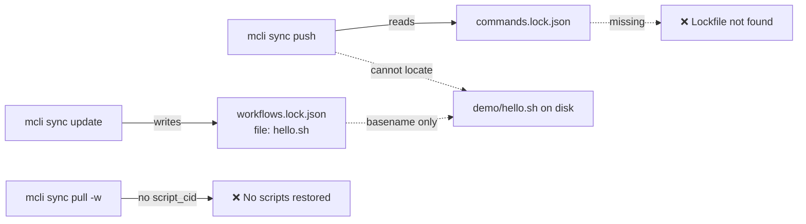
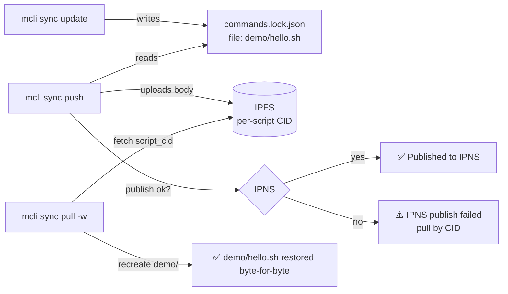

# Release Notes - Version 8.0.49

**Release Date:** 2026-05-29

## Overview

Version 8.0.49 is a bug-fix release that repairs the **core `mcli sync`
round-trip** (the lsh-parity IPFS/IPNS workflow). Three independent defects
prevented `mcli sync` from actually distributing workflow scripts end-to-end.
After this release a full `update → push → pull` cycle reconstructs every
workflow script — including those organized into group subdirectories —
byte-for-byte, and IPNS auto-resolve works for teammates on the same repo.

## Bugs Fixed

### 1. Lockfile filename mismatch broke every `push`/`pull` (critical)

`mcli sync update` wrote the lockfile as `workflows.lock.json` (via
`ScriptLoader`), while `mcli sync push`/`pull` read `commands.lock.json`. The
two halves of the feature never agreed, so **every push after an update failed**
with `Lockfile not found`. `ScriptLoader` now uses the canonical
`FileNames.COMMANDS_LOCK_JSON`, and the remaining hardcoded literals in
`sync_cmd.py` / `paths.py` were consolidated onto the same constant.

### 2. Grouped scripts never had their bodies synced (critical)

The lockfile recorded each command's `file` as a bare basename (`hello.sh`),
dropping the group subdirectory (`demo/`). `push` therefore could not locate
scripts living in subdirectories (the normal layout produced by
`mcli new -g <group>`), so their bodies were never uploaded and `pull`
reported *"manifest predates per-script CIDs"* even for a freshly-pushed
manifest. `ScriptLoader` now records the path **relative to the workflows
directory** (`demo/hello.sh`), and `pull_workflows` recreates the subdirectories
on disk.

### 3. `push` falsely claimed IPNS success

`push` printed *"Teammates can pull latest with: mcli sync pull"* whenever a
sync key was present — even when `publish_to_ipns` failed — giving a false
impression that auto-resolve would work. `push` now reports the IPNS result
honestly: it surfaces the published IPNS name on success and a clear
`IPNS publish failed` warning (with a pull-by-CID fallback hint) otherwise.

## Before / After

**Before** — the two halves of `sync` are wired to different lockfiles and
group subdirectories are lost, so nothing round-trips:



**After** — one canonical lockfile, relative paths preserved, bodies and
subdirectories round-trip, and IPNS status is reported truthfully:



## Validation

Validated end-to-end against a real Kubo (IPFS 0.39.0) daemon:

- `update → push → pull <CID> -w` reconstructs `demo/hello.sh` with a matching
  SHA-256.
- `update → push → pull -r <repo> -w` (IPNS auto-resolve, no CID) reconstructs
  the same script byte-for-byte.

New regression tests:

- `test_update_writes_lockfile_that_push_reads`
- `test_push_finds_lockfile_after_update`
- `TestGroupedScriptRoundTrip::test_loader_records_relative_path_and_push_uploads_subdir_script`
- `TestGroupedScriptRoundTrip::test_pull_workflows_reconstructs_subdirectories`
- `test_push_warns_when_ipns_publish_fails`
- `test_push_reports_ipns_success_when_published`

## Files Changed

- `src/mcli/lib/script_loader.py` — canonical lockfile name + relative `file` path
- `src/mcli/lib/ipfs_sync.py` — recreate subdirs on pull; track IPNS publish result
- `src/mcli/app/sync_cmd.py` — honest IPNS reporting; constant-based lockfile path
- `src/mcli/lib/paths.py` — `get_lockfile_path` uses the shared constant
- `src/mcli/lib/constants/messages.py` — `IPNS_TEAMMATE_PULL_HINT`
- `tests/unit/test_sync_cmd.py`, `tests/unit/test_ipfs_sync_script_bodies.py`

## Upgrade Guide

No breaking changes. Update to the new version:

```bash
uv tool install mcli-framework --force
# or
pip install --upgrade mcli-framework
```

Existing `workflows.lock.json` files are superseded automatically — run
`mcli sync update` once to regenerate the canonical `commands.lock.json`.

## Links

- **PyPI**: https://pypi.org/project/mcli-framework/8.0.49/
- **GitHub Release**: https://github.com/gwicho38/mcli/releases/tag/v8.0.49
- **Full Changelog**: https://github.com/gwicho38/mcli/compare/v8.0.48...v8.0.49
