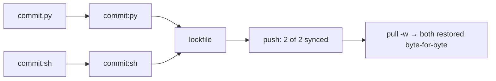

# Release Notes - Version 8.0.53

**Release Date:** 2026-06-01

## Overview

Version 8.0.53 fixes a **stem-collision data-loss bug** in `mcli sync`: scripts
sharing a base name (e.g. `commit.py` and `commit.sh`, or the same name in
different group subdirectories) were silently dropped from the lockfile, so
`mcli sync now`/`push` never transported them. On a real workflows directory
this dropped **32 of 119 scripts**.

## The Bug

`ScriptLoader.generate_lockfile()` keyed every command by its bare
`script_path.stem`:

```python
for script_path in scripts:
    name = script_path.stem          # "commit" for BOTH commit.py and commit.sh
    lockfile_data["commands"][name] = info   # second one overwrites the first
```

So two scripts with the same stem collapsed to a single lockfile entry — the
later silently clobbered the earlier. The `name:lang` disambiguation added in
v8.0.38 (`docs/features/LANGUAGE_SUFFIX.md`) was applied by `mcli list` / `mcli
run` at runtime, but **never by the lockfile**, so sync still lost the shadowed
scripts.

## The Fix

A single source of truth, `ScriptLoader._assign_command_keys()`, assigns every
discovered script a **unique** key using the existing convention:

- unique stem            → bare `stem` (`deploy`)
- stem collision         → `stem:lang` (`commit:py`, `commit:sh`)
- stem **and** lang both collide across dirs → `stem:lang:<dir-slug>` (and a
  final numeric guard) so identically named/typed scripts in different
  directories are each preserved.

Every lockfile-key consumer now derives its key from the same function, so
producer and verifier cannot drift:

- `generate_lockfile()` — writes one entry per script (no more drops).
- `verify_lockfile()` — maps disk scripts by canonical key (no false
  missing/extra in `sync diff`/`status`).
- `sync status` / `sync diff` (`sync_cmd.py`) — look up by canonical key and
  display the disambiguated name, matching `mcli list`.

**Unchanged (verified safe):** `mcli run` and `mcli list` resolve from live
filesystem discovery, not lockfile keys; `sync pull` reconstructs files from
each entry's `file` (relative path), not the key. So the round-trip and runtime
invocation are unaffected by the key-scheme change.

## Before / After

**Before** — colliding stems collapse; the shadowed script is lost before push:

```mermaid
flowchart LR
    A[commit.py] --> K[key = stem = 'commit']
    B[commit.sh] --> K
    K --> L[lockfile['commit']<br/>= commit.sh only]
    A -. overwritten .-> X[❌ commit.py dropped]
    L --> P[push: 1 of 2 synced]
```

**After** — each script gets a distinct key; both sync:



## Validation

- Engine: on a real 119-script workflows dir, `_assign_command_keys` now yields
  **119 unique keys** (was collapsing to 87 — recovers all 32 dropped), 63
  disambiguated.
- End-to-end CLI: `update → push → pull -w` of a `commit.py`/`commit.sh` pair
  restores **both** byte-for-byte; `sync status` shows both `synced`,
  `sync diff` reports in-sync.
- 6 new regression tests in `tests/unit/test_script_loader_stem_collision.py`;
  full `test_language_suffix` + sync suites green (189 tests).

## Files Changed

- `src/mcli/lib/script_loader.py` — `_assign_command_keys`, `generate_lockfile`, `verify_lockfile`
- `src/mcli/app/sync_cmd.py` — `sync status` / `sync diff` key by canonical key
- `tests/unit/test_script_loader_stem_collision.py` — new

## Upgrade Guide

No breaking changes. Update, then re-run `mcli sync update` once to regenerate
the lockfile with all scripts tracked:

```bash
uv tool install mcli-framework --force
mcli sync update
```

Colliding commands now appear as `name:lang` (e.g. `commit:py`) in `mcli list`,
`mcli sync status`, and the lockfile — invoke them with `mcli run commit:py`.

## Links

- **PyPI**: https://pypi.org/project/mcli-framework/8.0.53/
- **GitHub Release**: https://github.com/gwicho38/mcli/releases/tag/v8.0.53
- **Full Changelog**: https://github.com/gwicho38/mcli/compare/v8.0.52...v8.0.53
