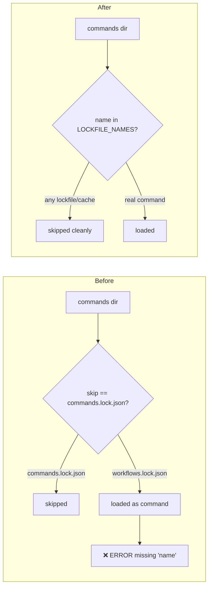

# Release Notes - Version 8.0.54

**Release Date:** 2026-06-01

## Overview

Version 8.0.54 silences a spurious error logged on **every** `mcli` invocation
for anyone who used sync before v8.0.49:

```
[ERROR] Command data missing 'name' key: ['version', 'generated_at', 'commands']
```

## The Bug

The v8.0.49 lockfile rename (`workflows.lock.json` → `commands.lock.json`) left
the old `workflows.lock.json` behind in users' command directories. The legacy
JSON-command loader (`CustomCommandManager.load_all_commands`) skipped only
`commands.lock.json`, so the stale `workflows.lock.json` was loaded as if it
were a command and failed the `name`-key check — logging an ERROR on startup.
It was cosmetic (the app continued), but noisy and alarming.

## The Fix

Introduced a single `LOCKFILE_NAMES` set (backed by new
`FileNames.WORKFLOWS_LOCK_JSON` / `FileNames.SYNC_CACHE_JSON` constants) and use
it everywhere the commands directory is scanned, so **all** lockfile/cache files
are skipped — current and legacy:

- `CustomCommandManager.load_all_commands` (the loader that logged the error)
- `has_custom_commands` (replaces a duplicated literal tuple)

## Before / After



## Validation

- Against a real dir containing a stale `workflows.lock.json`: the installed
  loader leaks 1 lockfile-shaped entry (the error); the fixed loader leaks 0.
- New regression tests in `tests/unit/test_custom_commands_skip_lockfiles.py`;
  `test_custom_commands*` suites green.

## Upgrade Guide

No breaking changes:

```bash
uv tool install mcli-framework --force
```

A stale `workflows.lock.json` in `~/.mcli/workflows/` (or a repo's
`.mcli/commands/`) is now ignored. It is safe to delete — the active lockfile is
`commands.lock.json`.

## Files Changed

- `src/mcli/lib/custom_commands.py` — `LOCKFILE_NAMES`; skip all lockfiles
- `src/mcli/lib/constants/paths.py` — `WORKFLOWS_LOCK_JSON`, `SYNC_CACHE_JSON`
- `tests/unit/test_custom_commands_skip_lockfiles.py` — new

## Links

- **PyPI**: https://pypi.org/project/mcli-framework/8.0.54/
- **GitHub Release**: https://github.com/gwicho38/mcli/releases/tag/v8.0.54
- **Full Changelog**: https://github.com/gwicho38/mcli/compare/v8.0.53...v8.0.54
