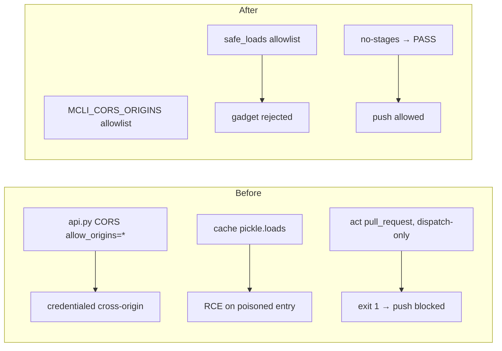

# Release Notes - Version 8.0.55

**Release Date:** 2026-06-01

## Overview

Version 8.0.55 closes out a batch of backlog issues from the 2026-03-29
production-readiness audit. After verifying the full backlog against current
code, **13 issues were confirmed already-fixed** (mostly by PR #192) and closed;
this release lands the **7 contained fixes** that were still valid — two
security hardenings plus five CI/resilience cleanups.

## Fixes

### Security

- **#164 — CORS wildcard with credentials.** `api.py` had two
  `allow_origins=["*"]` middleware blocks paired with `allow_credentials=True`.
  Both now use the existing `MCLI_CORS_ORIGINS` env allowlist (default
  `http://localhost:3000`), matching the already-safe third block.
- **#170 — pickle RCE from cache.** `cached_vectorizer._get_from_cache` called
  bare `pickle.loads` on Redis data; a poisoned entry could execute code. Added
  `SafeUnpickler` / `safe_loads` (allowlist of builtin containers/scalars +
  numpy array primitives) in `pickles.py` and routed the cache read through it.
  Verified: an `os.system` reduce gadget and bare `eval` are rejected; plain
  containers and numpy arrays still round-trip.

### Resilience / CI

- **#172 — subprocess hangs.** Added bounded `timeout=` to all non-interactive
  subprocess calls that lacked one (editor/version probes 5–10s, local git 30s,
  network git/installs 60–300s) across `commands_cmd`, `create_cmd`, `self_cmd`,
  `doc_convert`, `init_cmd`, `store_cmd`, `release_notes_cmd`, `ci`. Interactive
  editor launches are intentionally left unbounded.
- **#190 — Windows Popen crash.** `sync_cmd` hardcoded the POSIX-only
  `start_new_session=True`; now uses `creationflags=CREATE_NEW_PROCESS_GROUP` on
  Windows. No behavior change on Unix.
- **#205 — `mcli ci preflight` false FAIL.** A `workflow_dispatch`-only workflow
  made `act pull_request` exit non-zero with "Could not find any stages to run";
  the gate now recognizes this no-op as PASS instead of blocking the push.
- **#187 — Docker references to removed code.** Renamed `api_daemon` →
  `daemon_api` in `Dockerfile.lsh`; removed the dead training/ingestion/
  backtesting/mlflow stages from `Dockerfile` and deleted `docker/Dockerfile.ml`
  — all referenced the `mcli.ml` package removed in e4dd441.
- **#183 — inconsistent dev dependency groups.** `[dependency-groups].dev`
  (used by `uv sync`) was missing the test plugins the suite needs
  (pytest-asyncio/-mock, etc.) while `[project.optional-dependencies].dev` was
  missing the linters. Both are now the same 29-tool superset; version ranges
  reconciled.

## Backlog issues closed as already-fixed (verified against current code)

#165, #166, #167, #168, #171, #173, #174, #175, #180, #182, #184, #185, #186 —
all resolved by PR #192 (or later) and verified present in current code.

## Before / After



## Validation

- New tests: `tests/unit/test_safe_unpickle.py` (RCE gadget rejected, numpy
  round-trip), `test_ci_act_runner.py::test_no_stages_is_pass_not_fail`.
- 136 tests green across CI/sync/custom-commands/notebook suites; flake8/black
  clean.

## Upgrade Guide

No breaking changes:

```bash
uv tool install mcli-framework --force
```

If you front the API with a browser client, set `MCLI_CORS_ORIGINS` to your
origin(s) (comma-separated); it defaults to `http://localhost:3000`.

## Links

- **PyPI**: https://pypi.org/project/mcli-framework/8.0.55/
- **GitHub Release**: https://github.com/gwicho38/mcli/releases/tag/v8.0.55
- **Full Changelog**: https://github.com/gwicho38/mcli/compare/v8.0.54...v8.0.55
