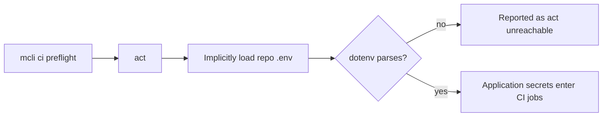
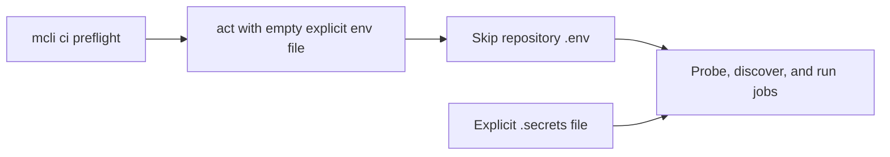

# Release Notes - Version 8.0.64

**Release Date:** 2026-08-31

## Overview

`mcli ci preflight` no longer lets `act` implicitly load the repository `.env`.
Application environment files can contain multiline JSON, certificates, and
other valid values that act's dotenv parser rejects. That made a healthy act and
container runtime look unreachable before workflow discovery even began.

## Before / After

**Before**

**After**

## Changes

- Probe, workflow discovery, and job execution now pass act an explicit empty
  environment file using the platform's null device.
- `.secrets` remains the intentional opt-in path for values needed by local CI.
- Dispatch fallback now discovers safe CI and security workflows such as
  `elixir-ci.yml` and `secret-scan.yml`; it excludes self-hosted fallbacks,
  deploys, releases, and unrelated manual workflows.
- New regression coverage locks the isolation and workflow selection into the
  gate.
- The hosted Safety job upgrades `setuptools` to the patched `>=83` release
  before scanning, closing CVE-2026-59890 instead of ignoring the advisory.

## Validation

- `tests/unit/workflow/test_ci_act_runner.py`: 37 passed.
- The Conduit reproduction proceeds past act capability detection with its
  existing multiline application `.env`.

## Upgrade Guide

No action is required. If a local CI job genuinely needs environment values,
put them in the ignored `.secrets` file rather than the application `.env`.
