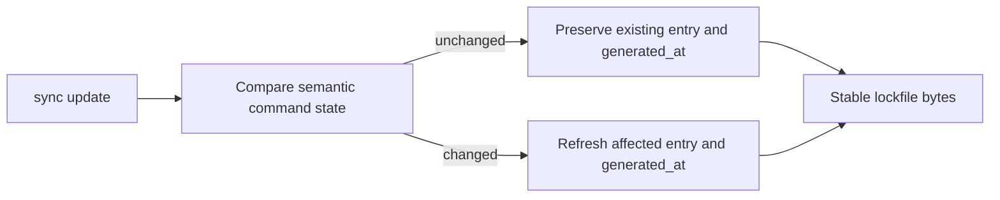

# Release Notes - Version 8.0.66

**Release Date:** 2026-09-04

## Overview

`mcli sync update` now treats the lockfile as a semantic snapshot, not a record
of filesystem timestamp churn. A second update with unchanged workflow content
leaves `commands.lock.json` byte-identical. When one workflow changes, unchanged
command entries keep the same metadata; only the changed entry and
`generated_at` move forward.

## Before / After

**Before**

**After**

## Changes

- Existing entries are reused when their path, language, source hash, and
  extracted metadata haven't changed, the schema is current, and their saved
  `last_modified` is a valid UTC timestamp. Filesystem mtime alone isn't treated
  as a logical command change.
- `generated_at` stays the same when the full command map and schema version
  haven't changed.
- Invalid command maps, malformed command entries, malformed JSON, old schema
  versions, and invalid generation timestamps are regenerated safely. Corrupt
  prior state isn't reused.
- A no-op update skips the write when the serialized lockfile is already
  identical.
- Script discovery uses relative paths as its deterministic ordering key,
  including scripts whose stems collide.

## Validation

- Added CLI-level regression coverage proving two consecutive no-op updates
  produce byte-identical lockfiles.
- Added coverage proving one changed script doesn't disturb an unchanged
  script's lock entry, even when its filesystem mtime moved.
- Added corruption-recovery, add/delete, semantic-metadata, and collision
  stability coverage.
- Ran the focused regression tests and the relevant sync and collision suites.

## Rollback

Revert the issue #229 change and version bump. The prior behavior will return:
each update will refresh `generated_at`, and filesystem mtime changes will alter
otherwise unchanged entries. The lockfile schema hasn't changed, so no data
migration is required.

## Issue

Fixes #229.
